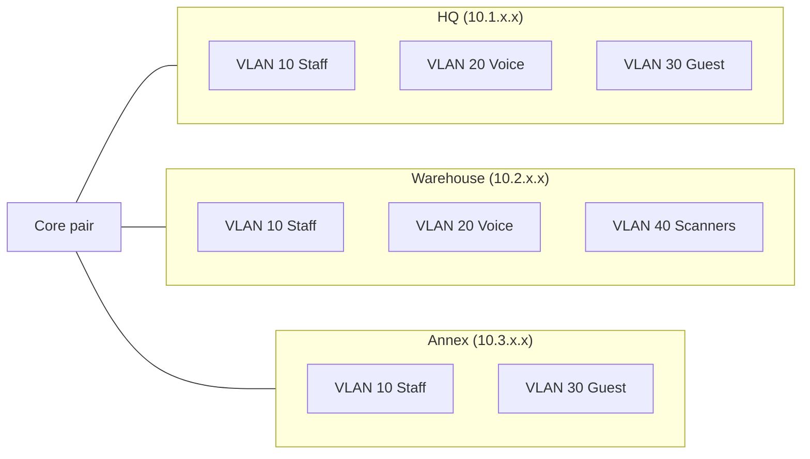
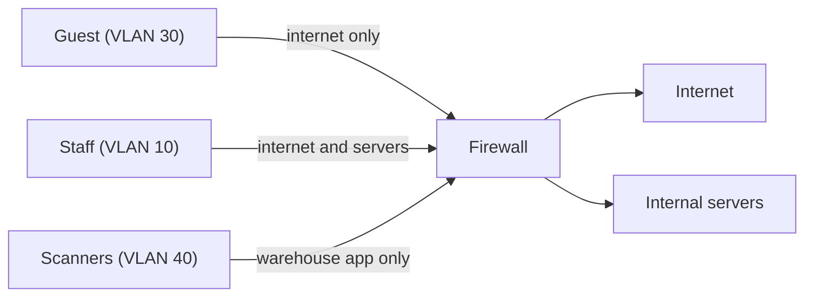

# Diagrams

## VLANs by building
Every building uses the same VLAN numbers, so a function always has the same ID.

```mermaid
graph LR
  CORE[Core pair]
  subgraph HQ["HQ (10.1.x.x)"]
    H10[VLAN 10 Staff]
    H20[VLAN 20 Voice]
    H30[VLAN 30 Guest]
  end
  subgraph WH["Warehouse (10.2.x.x)"]
    W10[VLAN 10 Staff]
    W20[VLAN 20 Voice]
    W40[VLAN 40 Scanners]
  end
  subgraph AN["Annex (10.3.x.x)"]
    A10[VLAN 10 Staff]
    A30[VLAN 30 Guest]
  end
  CORE --- HQ
  CORE --- WH
  CORE --- AN
```

## Firewall policy summary
Who can reach what.

```mermaid
graph LR
  G["Guest (VLAN 30)"] -->|internet only| FW[Firewall]
  S["Staff (VLAN 10)"] -->|internet and servers| FW
  SC["Scanners (VLAN 40)"] -->|warehouse app only| FW
  FW --> NET[Internet]
  FW --> APP[Internal servers]
```
